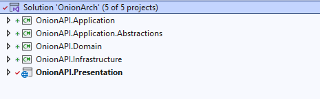

# Onion Arch

;

## 1) OnionAPI.Domain

### Purpose:

- Represents the core of the application where business logic and domain entities are defined.

### Responsibilities

- Defines business rules, entities, and value objects.
- Isolated from external concerns like data access, APIs, or UI.
- Does not depend on any other layers.\*

### Example:

- Classes: Entities: Product
- Interfaces: IProductRepository

## 2) OnionAPI.Application.Abstractions

### Purpose:

- Provides the contracts for the services and use cases

### Responsibilities

- Defines service contracts and interfaces for application use cases.
- Promotes loose coupling by allowing multiple implementations in different contexts.
- Serves as a bridge between the Domain layer and the implementation in Application.

### Example:

- Interfaces: IProductService, IOrderService.

## 3) OnionAPI.Application

### Purpose:

- Implements the business use cases by orchestrating operations in the domain and infrastructure layers.

### Responsibilities

- Coordinates business rules and workflows.
- Uses the abstractions defined in OnionAPI.Application.Abstractions.
- Does not directly interact with external systems but relies on interfaces in the Domain or Application.Abstractions layers.

### Example:

- ProductService, which uses IProductRepository.

## 4) OnionAPI.Infrastructure

### Purpose:

- Handles external concerns and provides implementations for abstractions.

### Responsibilities

- Implements data access, external API integrations, logging, or email sending.
- Adapts external systems to fit the application's internal abstractions.
- Depends on the Domain and Application.Abstractions layers.

### Example:

- Repositories: ProductRepository implementing IProductRepository.

## 5) OnionAPI.Presentation

### Purpose:

- Exposes APIs or UI for external consumption.

### Responsibilities

- Exposes APIs or UI for external consumption.
- Depends on Application to fetch or send data to and from the system.
- Does not contain business logic.

### Example:

- API Controllers: ProductsController using IProductService.
